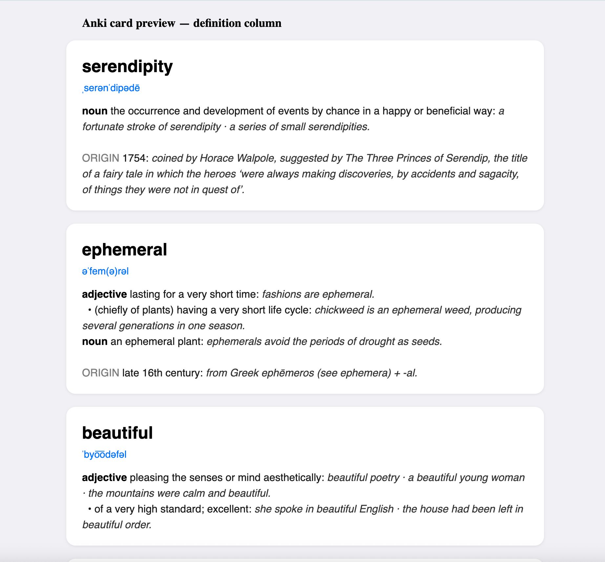

# 📖 Save looked-up words to a list

Select a word anywhere on your Mac (Safari, your news app, Mail, anywhere), press a
keyboard shortcut, and the word + its dictionary definition is appended to a CSV file you
can open in Numbers or Excel. It uses the *same* dictionaries as Apple's Dictionary app.

Definitions are saved as light HTML, so they import into Anki as clean, readable cards:



> **Why a hotkey instead of "just watching Dictionary.app"?**
> The Dictionary app and the macOS "Look Up" popover keep no history and expose no hook —
> nothing can record what you look up there. So this gives you a deliberate *"look up **and
> save**"* gesture. Keep using Dictionary.app for casual browsing; use the hotkey for the
> words you actually want to keep.

## What's here

| File | Role |
|------|------|
| `lookup_save.py` | The worker. Looks up a word and appends it to the CSV. No installs needed — uses Apple's built-in `/usr/bin/python3`. |
| `Save to Word List.workflow` | The trigger: an Automator **Quick Action**. Already installed to `~/Library/Services/`. |
| `batch_lookup.py` | Bulk-import: looks up many words at once — a column of a CSV, or every quoted word in a Markdown file — and adds them to your list. See **Bulk-import a word list** below. |

**Your list lives at:** `~/Documents/vocabulary.csv`
Columns: `word, pronunciation, definition, date_saved, source`.
To move it, change `CSV_PATH` at the top of `lookup_save.py`.

The **`definition`** column is light **HTML** — parts of speech in bold, numbered senses and
sub-senses on their own lines, example sentences in italics, etymology under a muted `ORIGIN`
heading — so it renders as a tidy card in Anki. To keep cards readable, the long `PHRASES`,
`PHRASAL VERBS`, and `DERIVATIVES` reference lists are dropped (e.g. *run* keeps its ~27 core
senses, not its ~70 idioms). See **Importing to Anki** below.

## One-time setup (≈1 minute)

The script and the Quick Action are already in place. You just need to assign a hotkey.

### 1. Assign the keyboard shortcut

1. Open **System Settings → Keyboard → Keyboard Shortcuts… → Services**.
2. Scroll to the **Text** section and find **“Save to Word List.”**
3. Tick its checkbox, then click **Add Shortcut** (or the shortcut field) and press your
   combo — e.g. **⌃⌥D** (Control-Option-D).
4. Close System Settings.

> If "Save to Word List" doesn't appear in the list yet, log out and back in once (or
> restart) — macOS sometimes needs a session refresh to pick up a newly installed Quick
> Action.

### 2. First-run permission prompts (expected, one time)

The first time you trigger it, macOS may ask to:

- **Allow notifications** — say yes, so you get the "Saved ✓" banner.
- **Control "System Events"** — this is only used to record *which app* you were in (the
  `source` column). Allowing it is nice-to-have; **denying it is fine** — the word still
  saves, the `source` column is just left blank.
- **Access your Documents folder** — needed to write the CSV. If you'd rather not grant
  this, change `CSV_PATH` in `lookup_save.py` to `~/vocabulary.csv` (your home folder isn't
  permission-protected).

## How to use it

1. Select a word while reading.
2. Press your shortcut (⌃⌥D).
3. A banner confirms **“📖 Word saved — <word> ✓.”** Done. It also tells you if a word is
   already on the list or has no dictionary entry.

Open `~/Documents/vocabulary.csv` in **Numbers** any time to browse your collection. (The
`definition` cells contain HTML tags, so they look their best in Anki, not Numbers.)

## Importing to Anki

1. In Anki: **File → Import…** and choose `~/Documents/vocabulary.csv`.
2. In the import dialog:
   - **Type:** Basic (or your preferred note type).
   - **Field separator:** Comma.
   - **✅ Allow HTML in fields** — important, or the `<br>`/`<b>` tags show up literally.
   - Map the columns to fields, e.g. **word → Front**, **definition → Back**. You can append
     `pronunciation` to the Front, or add extra fields for `pronunciation`/`source` if you like.
3. Import. Each word becomes a card with a cleanly laid-out definition on the back.

> Tip: because the `word` column is the first field, Anki will treat it as the key and skip
> duplicates on re-import — so you can keep importing the same growing CSV as you add words.

## Try it without the hotkey

```sh
echo "serendipity" | /usr/bin/python3 lookup_save.py
```

## Bulk-import a word list

Already have a list of words somewhere (a spreadsheet export, a reading log)? `batch_lookup.py`
runs the same look-up-and-save in one go. It picks the words based on the file type:

- **CSV** — reads one column (the **3rd** by default).
- **Markdown** (`.md`/`.markdown`) — every word/phrase inside `"double quotes"` on each line
  (both straight `"…"` and curly `"…"` quotes count).

```sh
/usr/bin/python3 batch_lookup.py --file words.csv      # 3rd column of a CSV
/usr/bin/python3 batch_lookup.py --file notes.md       # quoted words in Markdown
/usr/bin/python3 batch_lookup.py --file *.csv *.md     # mix and match
/usr/bin/python3 batch_lookup.py --file words.csv --column 2 --skip-header
```

- `--column N` picks the 1-based CSV column (default: **3**); ignored for Markdown.
- `--skip-header` drops the first row of a CSV. (Not strictly needed — a header cell like
  *"word"* has no dictionary entry, so it's skipped automatically.)
- Words already on your list, or with no dictionary entry, are skipped — re-running is safe.

Each word fires the usual "saved ✓" banner, so a few hundred words means a burst of notifications.

## If the Quick Action ever misbehaves — rebuild it by hand

The generated `.workflow` works on this machine, but if a macOS update breaks it, it's
trivial to recreate:

1. Open **Automator** → **New Document** → **Quick Action**.
2. At the top: set **“Workflow receives current”** to **text** in **any application**.
3. In the left search box, find **Run Shell Script** and drag it into the workflow.
4. Set **Shell** to `/bin/zsh` and **Pass input** to **to stdin**.
5. Replace the script box contents with exactly:
   ```sh
   /usr/bin/python3 "/Users/yunhao/Public/playground/lookup/lookup_save.py"
   ```
6. **File → Save**, name it **Save to Word List**. It installs itself; then redo step 1
   above to assign the hotkey.

## Uninstall

```sh
rm -rf "$HOME/Library/Services/Save to Word List.workflow"
```

(Your `vocabulary.csv` is untouched by this.)
